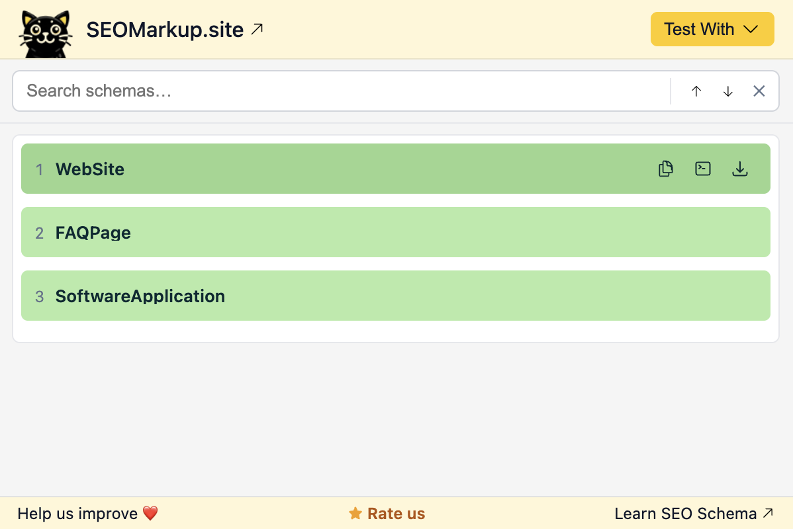

# SEOMarkup

**Inspect, understand, and generate structured data (JSON-LD) for the modern web.**

SEOMarkup is an open-source project with two parts:

| | |
|---|---|
| **[`app/`](app/)** | Chrome extension — inspect JSON-LD structured data on any page |
| **[`website/`](website/)** | Marketing site + free tools at [seomarkup.site](https://www.seomarkup.site) |

---

## Chrome Extension

Instantly view all JSON-LD structured data on the active tab. Supports `@graph` flattening, search/highlight, copy as JSON or `<script>` tag, download, and one-click validation via Google Rich Results Test and schema.org validator.

**[Install from the Chrome Web Store →](https://chromewebstore.google.com/detail/structured-data-schema-in/gaclifbkjcockpefkcjpgggmeolckind)**



### Run locally

```bash
# 1. Clone 
git clone https://github.com/deshanm/schema-markup.git
cd schema-markup

# 2. Open chrome://extensions in Chrome
# 3. Enable Developer mode
# 4. Click "Load unpacked" and select the app/ directory
```

See [`app/README.md`](app/README.md) for the full development guide and testing checklist.

---

## Website

The [seomarkup.site](https://www.seomarkup.site) site is an Astro project with:
- A landing page for the Chrome extension
- Resource articles on structured data and SEO
- Free tools: schema markup generator, rich result preview

### Run locally

```bash
cd website
npm install
npm run dev   # http://localhost:4321
```

See [`website/README.md`](website/README.md) for the full guide.

---

## Contributing

See [CONTRIBUTING.md](CONTRIBUTING.md) for how to contribute to either subproject.

## License

[MIT](LICENSE) — © 2026 
